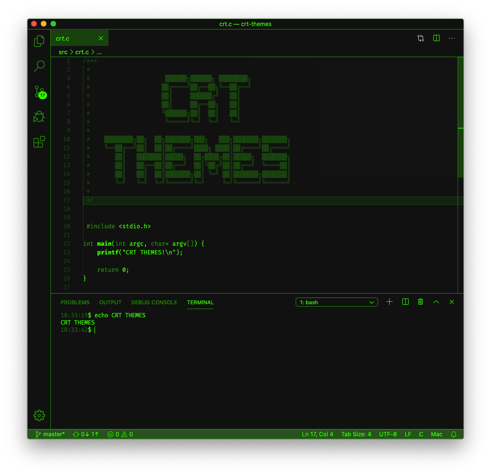
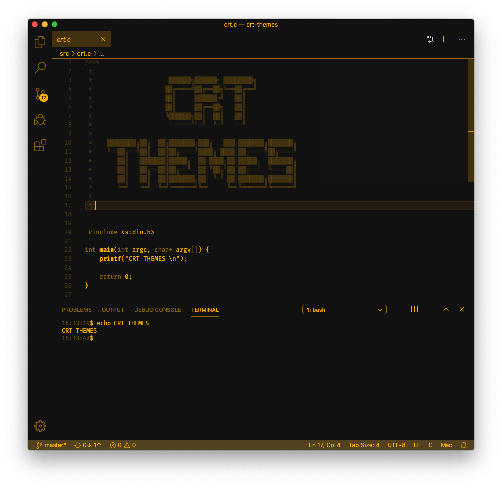
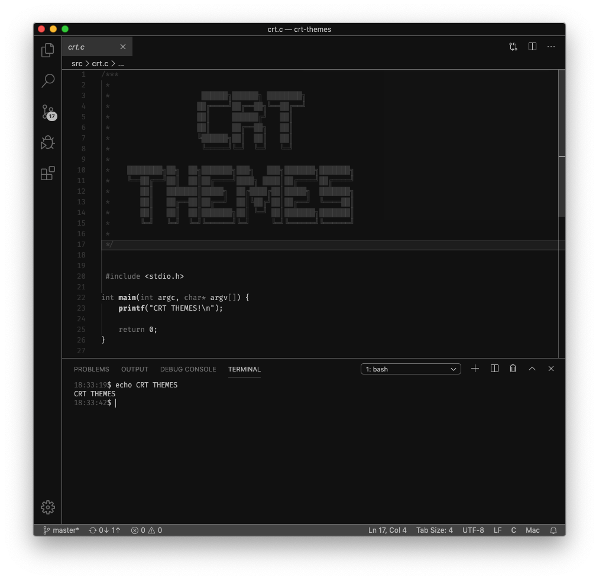

# CRT Themes

Retro-style themes with a monochrome flavor.

***Full workbench theming.***

## Features

CRT Themes tries to capture some of the old-school visuals of cathode ray tube-era computing monitors. The new version of the extension (0.6.x and newer) uses a 2-bit color design system with one background color and three levels of foreground intensities. A handful of example themes are included. Using the CRT Custom-theme the user can create a personalized theme with only two settings (see below).

## Extension Settings

This extension contributes the following settings:

* `crt-themes.foreground`: CRT Custom foreground color.
* `crt-themes.background`: CRT Custom background color.

## Known Issues

The amount of color attributes to customize in Visual Studio Code is huge. Please report any mistakes in the theming system or improvement suggestions, thx!

## Release Notes

### [0.6.0] - 2026-05-01

Long overdue update.

- Added a CRT Custom theme for users to customize.
- Customization on all available attributes.
- More work on consistency.
- Fixed the red theme file name issue.

### [0.5.2] - 2020-06-27

- More work on consistency.
- No borders on current line highlight.
- Improved red theme.

### [0.5.1] - 2020-03-07

- Improved legibility in the terminal.
- Improved consistency in use of color levels.

### [0.5.0] - 2020-03-02

- Initial release with a few basic themes.
