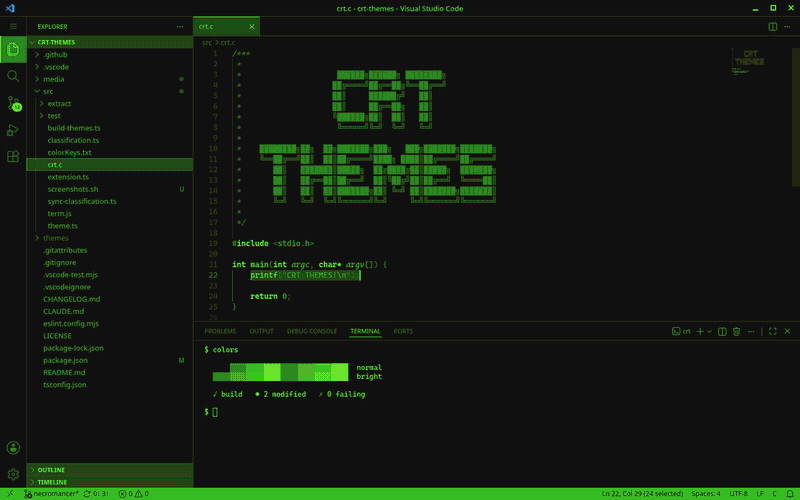
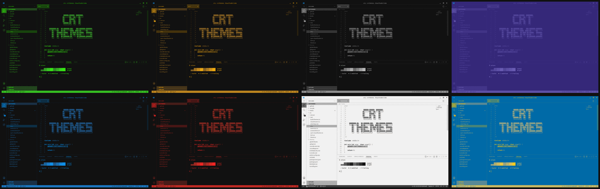

# CRT Themes

Retro-style themes with a monochrome flavor.

***Full workbench theming.***

## Features

CRT Themes tries to capture some of the old-school visuals of cathode ray
tube-era computing monitors. Each theme is built from just **two colors** — a
foreground and a background — and everything else is derived from that pair
by a 2-bit design system.

The mixing math runs in the perceptually uniform OKLab color space, so the
intensity steps should look evenly spaced to the human eye no matter which two
colors a theme starts from.

## Included themes

Each name links to a full-size screenshot.

| Theme      | Foreground | Background | Style |
| ---------- | ---------- | ---------- | ----- |
| [CRT Green](media/green.png)   | `#33ff00`  | `#111111`  | Classic green phosphor |
| [CRT Amber](media/amber.png)   | `#ffb000`  | `#111111`  | Amber phosphor |
| [CRT Gray](media/gray.png)     | `#bbbbbb`  | `#111111`  | White/gray phosphor |
| [CRT 64](media/64.png)         | `#6c5eb5`  | `#352879`  | Home-computer blue |
| [CRT Blue](media/blue.png)     | `#0099ff`  | `#111111`  | Blue phosphor |
| [CRT Red](media/red.png)       | `#ff2222`  | `#111111`  | Red phosphor |
| [CRT Paper](media/paper.png)   | `#0f0f0f`  | `#f0f0f0`  | Light, ink on paper |
| [CRT Custom](media/custom.png) | your choice | your choice | See below |

## CRT Custom — your own two colors

> **⚠ Note: This functionality, when used, adds over 1100 lines to your settings.json! ⚠**

The **CRT Custom** theme is generated from colors you pick:

1. Run *CRT Themes: Modify custom theme* from the command palette.
2. Enter a foreground and a background color (`#rgb` or `#rrggbb`).
3. The full theme is generated and applied immediately.

To fine-tune, run the command again — it is pre-filled with your current pair,
so it is two keystrokes and two Enters. Editing the color settings by hand does
not restyle anything on its own; the command is the only thing that writes.

Your custom colors are applied as color customizations in your user
`settings.json` (scoped to the CRT Custom theme). The first apply asks you to
confirm this; once the section is there it never asks again. To remove the
theme, delete that section together with the two color settings and pick
another theme — nothing is written back unless you run the command again.

Don't hand-edit the generated section: the next run of the command replaces it
wholesale. If you want to take the theme somewhere of your own, run
*Developer: Generate Color Theme From Current Settings* and work from the file
it gives you.

### Settings

- `crt-themes.foreground`: CRT Custom foreground color.
- `crt-themes.background`: CRT Custom background color.

Both record what the command last applied and pre-fill its prompts. Changing
them by hand takes effect the next time you run the command.

### Commands

- *CRT Themes: Modify custom theme* — prompt for the two colors, generate
  and switch to CRT Custom.

## Known Issues

The amount of color attributes to customize in Visual Studio Code is huge.
Please report any mistakes in the theming system or improvement suggestions,
thx!

## Release Notes

### [0.9.0] - 2026-08-01

Complete rewrite of the theme generation — the first release in six years.
The look of every theme changes with this update. Published on the pre-release
channel ahead of 1.0.0 — 0.5.2 remains stable in the meantime.

- All workbench color keys classified into design-system roles; every value
  derived from just a foreground/background pair.
- Perceptual mixing in OKLab for evenly spaced intensity levels.
- Flatter, more retro look: one background for the editor, sidebars and
  panels, plus a single raised surface for popups and menus. Selections and
  decorations are translucent, so text keeps its contrast over them.
- Terminal ANSI colors spread across the legible intensity range, ordered by
  the perceived brightness of the real ANSI colors.
- New CRT Custom theme: pick your own foreground/background from a command.
- Fixed the red theme file name issue.

### [0.5.2] - 2020-06-27

- More work on consistency.
- No borders on current line highlight.
- Improved red theme.

### [0.5.1] - 2020-03-07

- Improved legibility in the terminal.
- Improved consistency in use of color levels.

### [0.5.0] - 2020-03-02

- Initial release with a few basic themes.
