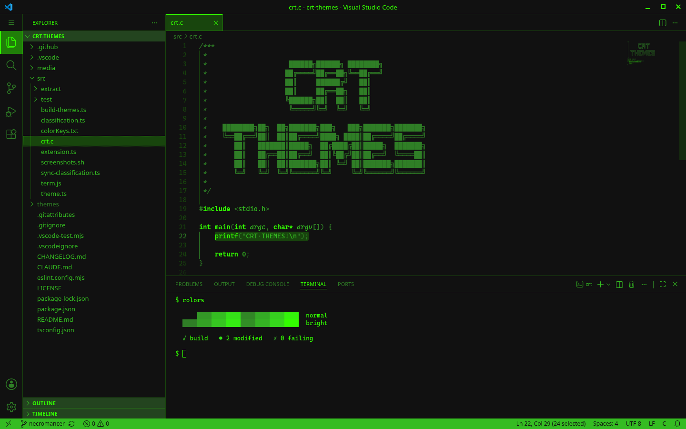
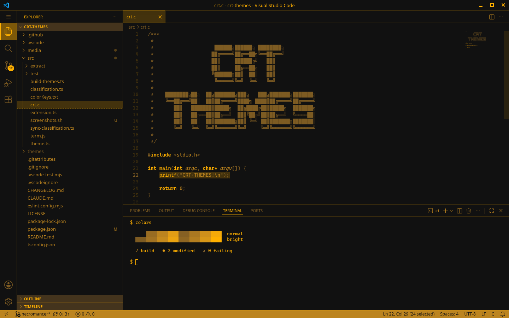
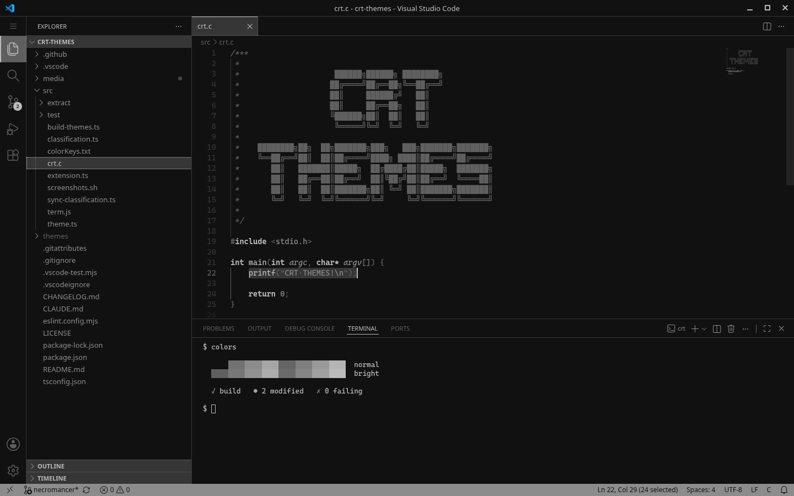

# CRT Themes

Retro-style themes with a monochrome flavor.

***Full workbench theming.***

## Features

CRT Themes tries to capture some of the old-school visuals of cathode ray
tube-era computing monitors. Each theme is built from just **two colors** — a
foreground and a background — and everything else is derived from that pair
by a 2-bit design system:

- **One flat background.** Every surface — editor, sidebar, panels, menus,
  widgets — is the same background color. Depth and grouping are drawn with
  thin borders, not tinted fills, like a text-mode UI.
- **Four foreground intensities.** Syntax highlighting and UI text use a
  ladder of four evenly spaced foreground levels (plus bold/italic), the way
  a real monochrome terminal would express "color".
- **Reverse video for emphasis.** The status bar, badges and buttons invert
  to full-intensity foreground with background-colored text.
- **Muted highlight blocks.** Selections and hover highlights are solid
  blocks of the lowest foreground intensity, so highlighted text stays
  crisp.

The mixing math runs in the perceptually uniform OKLab color space, so the
intensity steps look evenly spaced to the human eye no matter which two
colors a theme starts from.

## Included themes

| Theme      | Foreground | Background | Style |
| ---------- | ---------- | ---------- | ----- |
| CRT Green  | `#33ff00`  | `#111111`  | Classic green phosphor |
| CRT Amber  | `#ffb000`  | `#111111`  | Amber phosphor |
| CRT Gray   | `#bbbbbb`  | `#111111`  | White/gray phosphor |
| CRT Blue   | `#0099ff`  | `#111111`  | Blue phosphor |
| CRT Red    | `#ff2222`  | `#111111`  | Red phosphor |
| CRT 64     | `#6c5eb5`  | `#352879`  | Home-computer blue |
| CRT Paper  | `#0f0f0f`  | `#f0f0f0`  | Light, ink on paper |
| CRT Custom | your choice | your choice | See below |

## CRT Custom — your own two colors

The **CRT Custom** theme is generated from colors you pick:

1. Run *CRT Themes: Create custom theme* from the command palette.
2. Enter a foreground and a background color (`#rgb` or `#rrggbb`).
3. The full theme is generated and applied immediately.

Alternatively, enable `crt-themes.dynamicApplication` and edit the color
settings directly — the workbench restyles live as you change them.

Your custom colors are applied as color customizations in your user
`settings.json` (scoped to the CRT Custom theme). Any customizations you
already had there are **backed up first**, and *CRT Themes: Reset Custom
Overrides* restores them exactly as they were.

### Settings

- `crt-themes.foreground`: CRT Custom foreground color.
- `crt-themes.background`: CRT Custom background color.
- `crt-themes.dynamicApplication`: apply the CRT Custom colors to your
  settings automatically whenever they change.

### Commands

- *CRT Themes: Create custom theme* — prompt for the two colors, generate
  and switch to CRT Custom.
- *CRT Themes: Reset Custom Overrides* — remove the generated
  customizations and restore whatever was there before.
- *CRT Themes: Show available color keys in a new window* — list every
  themable VS Code color key (mostly useful for theme development).

## Known Issues

The amount of color attributes to customize in Visual Studio Code is huge.
Please report any mistakes in the theming system or improvement suggestions,
thx!

## Release Notes

### [1.0.0] - 2026-06-12

Complete rewrite of the theme generation — the first release in six years.
The look of every theme changes with this update.

- All workbench color keys classified into design-system roles; every value
  derived from just a foreground/background pair.
- Perceptual mixing in OKLab for evenly spaced intensity levels.
- Flatter, more retro look: one background surface, border-drawn depth,
  muted-block selections, reverse-video status bar and buttons.
- New CRT Custom dynamic theme with live application and safe
  backup/restore of existing customizations.
- Fixed the red theme file name issue.

### [0.5.2] - 2020-06-27

- More work on consistency.
- No borders on current line highlight.
- Improved red theme.

### [0.5.1] - 2020-03-07

- Improved legibility in the terminal.
- Improved consistency in use of color levels.

### [0.5.0] - 2020-03-02

- Initial release with a few basic themes.
